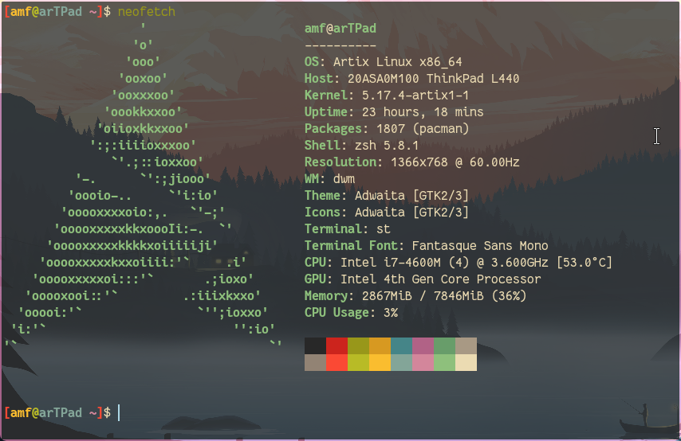

# Simple Terminal (st)

### my own build of suckless st

## Unique features (using dmenu)
- follow urls by pressing `alt-l`
- copy urls in the same way with `alt-y`
- copy the output of commands with `alt-o`

---

## Bindings for
- scroll with `alt-↑/↓` or `alt-pageup/down`.
- OR vim-bindings: scroll up/down in history with `alt-k` and `alt-j`. Faster with `alt-u`/`alt-d`.
- zoom/change font size: same bindings as above, but holding down `shift` as well. `alt-home` returns to default
- copy text with `alt-c`, paste is `alt-v` or `shift-insert`

---

## Pretty stuff
- Compatibility with `.Xresources` and `pywal` for dynamic colors.
- Default [gruvbox](https://github.com/morhetz/gruvbox) colors otherwise.
- Transparency/alpha, which is also adjustable from your `.Xresources`.
- Default font is system "mono" at 14pt, meaning the font will match your system font.

---

## Other st patches
- Boxdraw
- Ligatures
- font2
- updated to latest version 0.8.4

---

## Screenshot
   

---

## Installation
You should have xlib header files and libharfbuzz build files installed.
```
git clone https://github.com/AbdeltwabMF/st
cd st
sudo make clean install
```
